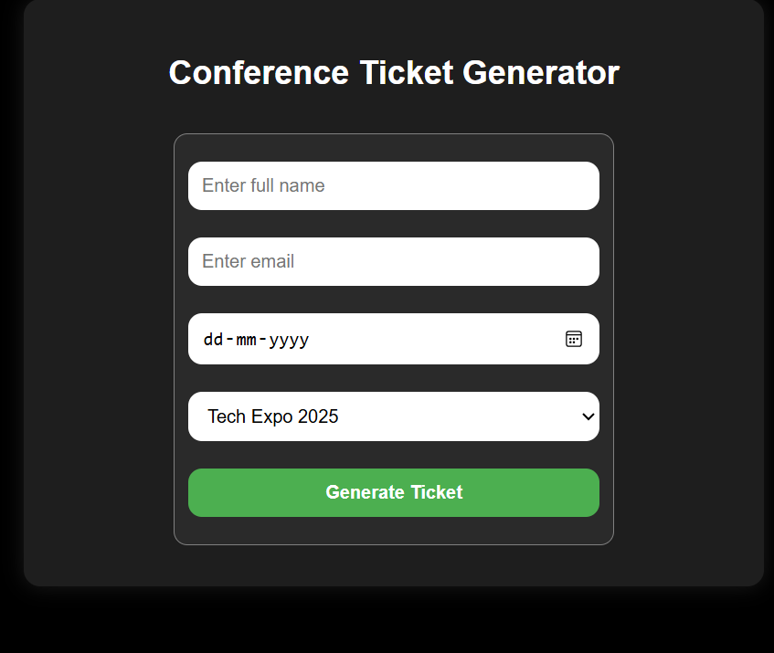
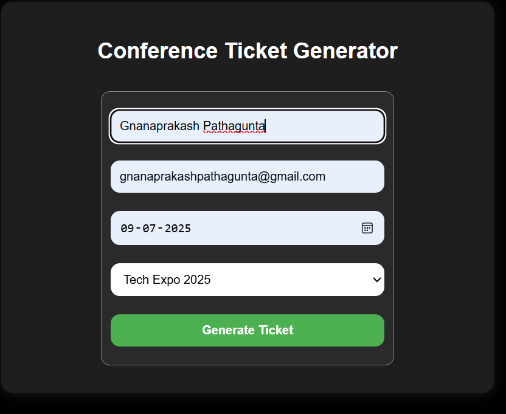
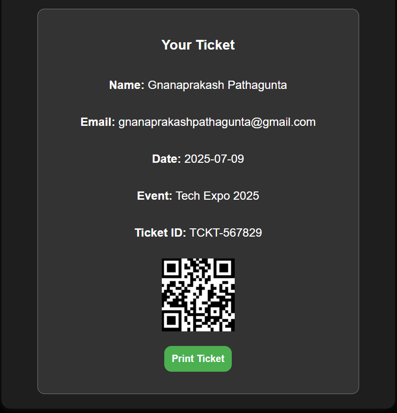
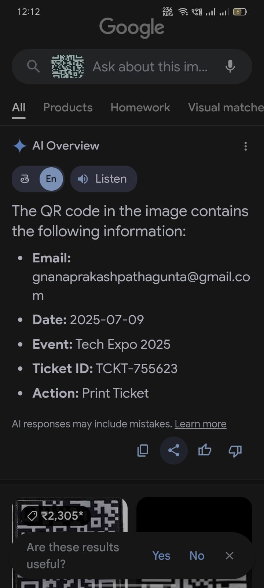

# 🎟️ Conference Ticket Generator

A responsive web application to generate personalized conference tickets with a unique Ticket ID and QR code. Built using **HTML, CSS, and JavaScript**, this app enables quick ticket creation for events like Tech Expo 2025 and AI Meetups.

## 🚀 Features

- Enter name, email, date, and select an event
- Generate a **unique Ticket ID** and **QR Code**
- Stylish and responsive ticket preview
- **Print your ticket** directly from the browser
- Data is stored in **localStorage** (no backend required)

## 🌐 Live Demo

🔗 [View Live on GitHub Pages](https://prakash-123705.github.io/Conference-ticket-generator/)

## 🛠️ Built With

- HTML5
- CSS3
- JavaScript (Vanilla)
- [QRCode.js](https://github.com/davidshimjs/qrcodejs) via CDN

## 📸 Screenshots

## 📂 How to Use

1. Clone or download this repository.
2. Open `index.html` in a web browser.
3. Fill in the form → click **Generate Ticket**.
4. View and print your personalized ticket.

## 📎 Notes

- All ticket data is stored in the browser using `localStorage`.
- No backend/server required.
- Responsive and print-optimized layout.

## 👨‍💻 Author

**Gnanaprakash Pathagunta**  
📎 [GitHub](https://github.com/Prakash-123705)  
🌐 [Portfolio](https://prakash-123705.github.io)

---

